## name

> gocmdb

## Requirements Analaysis

- a agent golang process can do cmdb collect
- cmdb:
  - process (exclude sshd kworker etc ..)
    - execute of process
    - name of process
    - start mode(docker, systemd, or just native start)
    - listen port of process
    - net_in_bytes base the listen port of process
    - cpu of process
    - memory of process
    - diskusage of process
    - iousage of process
- base the collect data, saved to TSDB
---
all the above ,the final target is establish the net between processs, even the processes is not is same machine


## Architecture Overview
> The agent will follow a Collector-Transformer-Exporter pattern. Since you want to link PIDs to network and disk usage, we need a "Context Mapper" to join these disparate data sources.

### High-Level Architecture

```mermaid
flowchart TB
    subgraph DataSources["📊 Data Sources"]
        PROC["/proc filesystem"]
        NETSTAT["Network Sockets"]
        EBPF["eBPF/XDP"]
        GOPSUTIL["gopsutil"]
    end

    subgraph Collector["🔍 Collector Layer"]
        PROBER["Prober"]
        LINKER["Linker<br/>(Context Mapper)"]
        FILTER["Filter Engine"]
    end

    subgraph Transformer["⚙️ Transformer Layer"]
        MAPPER["PID → Port → Path → Disk"]
        ENRICHER["Metric Enricher"]
        SCHEMA["Line Protocol Formatter"]
    end

    subgraph Exporter["📤 Exporter Layer"]
        ACCUM["Accumulator<br/>(Memory Buffer)"]
        PERSIST["Persistent Buffer<br/>(Disk)"]
        SHIPPER["Shipper<br/>(Retry + Backoff)"]
    end

    subgraph Backend["🗄️ Backend"]
        VM["VictoriaMetrics"]
        CMDB["CMDB Database"]
    end

    PROC --> PROBER
    NETSTAT --> PROBER
    EBPF --> PROBER
    GOPSUTIL --> PROBER

    PROBER --> FILTER
    FILTER --> LINKER
    LINKER --> MAPPER
    MAPPER --> ENRICHER
    ENRICHER --> SCHEMA

    SCHEMA --> ACCUM
    ACCUM -->|"batch every 1min"| SHIPPER
    ACCUM -->|"on failure"| PERSIST
    PERSIST -->|"retry"| SHIPPER
    SHIPPER --> VM
    SHIPPER --> CMDB
```



Key Components:
- The Prober: Uses gopsutil or /proc to gather raw data.
- The Linker: The "secret sauce" that maps a Listening Port -> PID -> Executable Path -> Disk Mount.
- The Filter: A regex-based engine to exclude sshd, kworker, etc.
- The Exporter: base https://github.com/VictoriaMetrics/VictoriaMetrics/tree/master/app/vmagent  to implement data local cache, retry, send to victoriametrics batch
  - The Accumulator (Memory): Collects metrics every minute and batches them to reduce HTTP overhead.
  - The Persistent Buffer (Disk): If the DB is down or the network is flaky, data is written to a fast, append-only file on disk.
  - The Shipper (Network + Retry): A background worker that pulls from the buffer and sends to the DB using Exponential Backoff.

## Technical Implementation Strategy

###  Process & Resource Mapping

> Don't reinvent the wheel—use gopsutil. It's the industry standard for Go.


- CPU/Mem: Use Process.Percent() and Process.MemoryInfo().
- Filtering: Use a configuration file (or env var) to define an ExcludeList.
- Tip: Filter early in the loop to save CPU cycles.

### Process I/O Usage

> Track read/write bytes per process using `/proc/PID/io`


### Process Start Mode Detection

> Detect how a process was started: k8s, docker, systemd, or native


### process aggreation


#### Key Rules from pstree Analysis

| Rule | Description | Action |
|------|-------------|--------|
| **Skip threads** | `{name}(tid)` in curly braces | Don't collect - already in parent metrics |
| **Find service root** | Direct child of PID 1 (systemd) | This is the service |
| **Aggregate children** | Same exe as parent | Sum metrics to parent |
| **Separate service** | Different exe (crond→python) | Treat as separate service |

#### Implementation: Simple pstree-like Logic  ref example/processdemo

#### 


### The Service-to-Disk Chain

- This is the trickiest part. You need to bridge the gap between a network socket and a physical disk.


- Listen Ports: Find PIDs listening on TCP/UDP (via /proc/net/tcp or gopsutil/net).
- Deploy Path: Use os.Readlink("/proc/<pid>/exe") to find where the binary lives.
- Disk Usage: Once you have the path, identify the mount point and use unix.Statfs to get usage for that specific partition.

###  Network Traffic 

> traffic per service, check the linux kernel, when linux kernel > 4.4 use a library like cilium/ebpf,else use socket counters.


- AF_PACKET + MMAP： ref [gopacket](./example/gopacketdemo/README.md)

- eBPF: Use a library like cilium/ebpf. It allows you to trace tcp_sendmsg and tcp_cleanup_rbuf to get exact byte counts per PID with near-zero overhead. ref [ebpfdemo](./example/ebpfdemo/README.md)

### eBPF XDP Data Flow

```mermaid
flowchart LR
    subgraph Kernel["🔧 Kernel Space"]
        NIC["NIC Driver"]
        XDP["XDP Hook<br/>(Earliest Point)"]
        PARSE["Parse Packet<br/>ETH → IP → TCP/UDP"]
        FILTER{"Match<br/>Filter Rule?"}
        ACTION["Action:<br/>PASS/DROP/COUNT"]
        BPFMAP["BPF Map<br/>(flow_key → stats)"]
    end

    subgraph User["👤 User Space"]
        POLL["Poll Map<br/>Every N seconds"]
        PRINT["Print Stats"]
        EXPORT["Export Metrics"]
    end

    NIC --> XDP
    XDP --> PARSE
    PARSE --> FILTER
    FILTER -->|"Yes"| ACTION
    FILTER -->|"No"| NIC
    ACTION --> BPFMAP
    BPFMAP -.->|"read"| POLL
    POLL --> PRINT
    POLL --> EXPORT
```



## Exporter Data Flow


## collect Data Schema 

> To make this CMDB-friendly, use https://docs.influxdata.com/influxdb3/core/reference/line-protocol/

### cmdb 
- example:

```
services,instance_id=node-10-104-111-16,name=clusterfileplugin,instance_ip=10.104.111.16,bin_path=/clusterfileplugin,start_mode=k8s,detail_cmd=75a207a4c0840c7a00d994cf7fa294ef7fed57e7f0ae107efcb4858b4ab797b8 pid=6621i,listen_ports="",cpu_pct=0.02,mem_bytes=24076288i,io_read_bytes=70148096i,io_write_bytes=8126464i,io_read_mb=66.90,io_write_mb=7.75,io_read_kbps=0.00,io_write_kbps=0.00,root_pid=6621i,child_count=1i 1769748861679319010
services,instance_id=node-10-104-111-16,name=bo-self_monitor,instance_ip=10.104.111.16,bin_path=/usr/local/bin/bo-self_monitor,start_mode=systemd,detail_cmd=daa4cd11f60276870f97c4d5da7bcf0a4da1021a0cf2e78b23e1a3d5f0460c2d pid=17748i,listen_ports="",cpu_pct=0.02,mem_bytes=11431936i,io_read_bytes=315392i,io_write_bytes=1015808i,io_read_mb=0.30,io_write_mb=0.97,io_read_kbps=0.00,io_write_kbps=0.00,root_pid=17748i,child_count=1i 1769748861679319010
```

### network trafic

- example:

```
network-traffic,dst_ip=,dst_port=,src_ip=,bytes_receive=40040
```

### Data Schema Diagram


## SRE "Best Practices" for the Agent

```mermaid
flowchart TB
    subgraph Practices["🛡️ Best Practices"]
        TIMEOUT["Self-Limiting<br/>context.WithTimeout(10s)"]
        CONCURRENT["Concurrency<br/>sync.WaitGroup"]
        ATOMIC["Atomic Writes<br/>.tmp → rename"]
        STATIC["Static Build<br/>CGO_ENABLED=0"]
    end

    subgraph Timeout["Timeout Flow"]
        T1["Start Collection"]
        T2{"< 10s?"}
        T3["Complete"]
        T4["Kill + Alert"]
    end

    subgraph Atomic["Atomic Write Flow"]
        A1["Write data.tmp"]
        A2["fsync()"]
        A3["rename → data.json"]
    end

    T1 --> T2
    T2 -->|"Yes"| T3
    T2 -->|"No"| T4

    A1 --> A2
    A2 --> A3
```



- Self-Limiting: Wrap the execution in a context.WithTimeout. If the collection takes longer than 10 seconds, kill it and alert. You don't want a "zombie collector" eating the resources it's supposed to monitor.
- Concurrency: Use a WaitGroup to fetch process list and network stats in parallel.
- Atomic Writes: If you are outputting to a file, write to a .tmp file and rename it to prevent the CMDB consumer from reading a half-written file.
- Static Compilation: Use CGO_ENABLED=0 go build to ensure the binary runs on any Linux distro regardless of GLIBC versions.

## Docker/Container Special Handling

> Containers introduce namespace isolation (PID, network, mount) that requires special handling to accurately collect metrics.

### Container Detection Flow


### Container Namespace Challenges

```mermaid
flowchart LR
    subgraph Namespaces["🔒 Linux Namespaces"]
        PIDNS["PID Namespace<br/>Different PID inside/outside"]
        NETNS["Network Namespace<br/>Isolated network stack"]
        MNTNS["Mount Namespace<br/>Different filesystem view"]
    end

    subgraph Problems["⚠️ Problems"]
        P1["Container PID 1 ≠ Host PID"]
        P2["Container ports via NAT"]
        P3["/proc/PID/exe points to overlay"]
    end

    subgraph Solutions["✅ Solutions"]
        S1["Use Host PID from /proc"]
        S2["Parse docker-proxy or iptables"]
        S3["Resolve through /proc/PID/root"]
    end

    PIDNS --> P1 --> S1
    NETNS --> P2 --> S2
    MNTNS --> P3 --> S3
```



### Container-Aware Collection


### Container Network Modes


### Implementation: Container ID Extraction

```go
// Example: Extract container ID from /proc/PID/cgroup
func getContainerID(pid int) (string, error) {
    data, err := os.ReadFile(fmt.Sprintf("/proc/%d/cgroup", pid))
    if err != nil {
        return "", err
    }
    
    // Docker cgroup v1: /docker/<container_id>
    // Docker cgroup v2: /system.slice/docker-<container_id>.scope
    // Kubernetes: /kubepods/pod<pod_id>/<container_id>
    
    re := regexp.MustCompile(`docker[/-]([a-f0-9]{64})`)
    matches := re.FindStringSubmatch(string(data))
    if len(matches) > 1 {
        return matches[1][:12], nil // Short ID
    }
    return "", nil // Not a container
}
```

### Container-Enriched Data Schema


### Updated Line Protocol with Container Tags

```
# Native process
services,instance_id=i-0abc,name=nginx,bin_path=/usr/sbin/nginx pid=1234i,cpu_pct=2.5 1700000000000000000

# Container process
services,instance_id=i-0abc,name=nginx,container_id=abc123def456,container_name=web-nginx,image=nginx,image_tag=1.25,network_mode=bridge pid=5678i,cpu_pct=1.2 1700000000000000000

# Kubernetes pod
services,instance_id=i-0abc,name=nginx,container_id=abc123def456,pod_name=web-nginx-7d4b8c,namespace=production,image=nginx,image_tag=1.25 pid=5678i,cpu_pct=1.2 1700000000000000000
```

### Container Detection Sequence


### eBPF Considerations for Containers


### Container-Aware Agent Deployment

```mermaid
flowchart LR
    subgraph Deployment["📦 Deployment Options"]
        BINARY["Host Binary<br/>with docker.sock access"]
        DAEMONSET["K8s DaemonSet<br/>hostPID: true"]
        PRIVILEGED["Privileged Container<br/>access to /proc"]
    end

    subgraph Requirements["🔑 Requirements"]
        R1["Mount /var/run/docker.sock"]
        R2["Mount /proc (hostPath)"]
        R3["CAP_SYS_PTRACE"]
        R4["CAP_NET_ADMIN"]
    end

    BINARY --> R1
    BINARY --> R3
    DAEMONSET --> R2
    DAEMONSET --> R3
    DAEMONSET --> R4
    PRIVILEGED --> R2
    PRIVILEGED --> R1
```



### Kubernetes-Specific Enrichment

```mermaid
flowchart TB
    subgraph K8s["☸️ Kubernetes Environment"]
        POD["Pod"]
        CONTAINER["Container"]
        LABELS["Pod Labels<br/>app, version, team"]
        NS["Namespace"]
    end

    subgraph Sources["Data Sources"]
        CGROUP["/proc/PID/cgroup<br/>→ pod UID"]
        CRICTL["crictl inspect"]
        DOWNWARD["Downward API<br/>(if running in cluster)"]
    end

    subgraph Output["Enriched Tags"]
        T1["pod_name"]
        T2["namespace"]
        T3["app_label"]
        T4["deployment"]
    end

    POD --> CGROUP
    CONTAINER --> CRICTL
    LABELS --> DOWNWARD
    CGROUP --> T1
    CGROUP --> T2
    CRICTL --> T3
    DOWNWARD --> T4
```

## Potential Pitfalls

```mermaid
flowchart LR
    subgraph Pitfalls["⚠️ Pitfalls"]
        PERM["Permission Denied"]
        CHURN["High PID Churn"]
        DOCKER["Docker Socket Access"]
        NETNS["Network Namespace Isolation"]
    end

    subgraph Solutions["✅ Solutions"]
        CAP["Add Capabilities<br/>CAP_NET_RAW<br/>CAP_SYS_PTRACE"]
        FREQ["Increase Frequency<br/>or Accept Gaps"]
        SOCK["Mount docker.sock<br/>or use containerd"]
        NSENTER["nsenter or<br/>attach to container netns"]
    end

    PERM -->|"fix"| CAP
    CHURN -->|"fix"| FREQ
    DOCKER -->|"fix"| SOCK
    NETNS -->|"fix"| NSENTER
```

- Permission Denied: To see other processes' disk and network info, the util will likely need sudo or CAP_NET_RAW / CAP_SYS_PTRACE capabilities.
- High PID Churn: If the ECS instance has many short-lived processes, your "1-minute snapshot" might miss them. (Usually fine for CMDB, bad for billing).
- Docker Socket Access: Agent needs access to `/var/run/docker.sock` to query container metadata. For Kubernetes, may need `crictl` or kubelet API.
- Network Namespace Isolation: Containers in bridge mode have isolated network stacks. Use `nsenter -t PID -n` to enter container's network namespace if needed.

## Component Interaction Sequence

```mermaid
sequenceDiagram
    participant Timer
    participant Prober
    participant Linker
    participant Filter
    participant Exporter
    participant VM as VictoriaMetrics

    Timer->>Prober: Tick (every 1 min)
    
    par Parallel Collection
        Prober->>Prober: Get Process List
        Prober->>Prober: Get Network Stats
        Prober->>Prober: Get eBPF Maps
    end

    Prober->>Filter: Raw Metrics
    Filter->>Filter: Apply ExcludeList
    Filter->>Linker: Filtered Metrics
    
    Linker->>Linker: Map Port→PID→Path→Disk
    Linker->>Exporter: Enriched Metrics
    
    Exporter->>Exporter: Format Line Protocol
    Exporter->>Exporter: Batch (max 1000)
    
    alt Backend Available
        Exporter->>VM: HTTP POST /write
        VM-->>Exporter: 200 OK
    else Backend Down
        Exporter->>Exporter: Write to Disk Buffer
        Note over Exporter: Retry with backoff
    end
```
