## Service Dependency Mapping (Cross-Machine)

> Goal: Build a service topology showing `Process A (Machine X) → Process B (Machine Y)`

### Data Join Strategy


### Required Data for Cross-Machine Correlation

| Metric | Fields Needed | Purpose |
|--------|---------------|---------|
| SERVICE | `instance_id`, `instance_ip`, `listen_ports`, `name` | Identify which service listens on which IP:port |
| NETWORK_TRAFFIC | `src_ip`, `dst_ip`, `dst_port`, `bytes` | Capture traffic flows |

### TSDB Query Example (PromQL/MetricsQL)

```promql
# Step 1: Get all services with their listen ports
services{listen_ports=~".+"}

# Step 2: Get traffic to specific destination
network_traffic{dst_ip="10.0.0.2", dst_port="3306"}

# Step 3: Join to find caller (requires instance_ip in SERVICE)
# In VictoriaMetrics, use label_join or external processing
```

### Recommended: Add Caller Tracking (Enhanced)

For **accurate** process-to-process mapping, we need to know which **local process** initiated the outbound connection:

```mermaid
flowchart LR
    subgraph Enhanced["🔍 Enhanced Collection"]
        LSOF["ss -tnp or /proc/net/tcp"]
        CONN["Active Connections<br/>local_ip:local_port → remote_ip:remote_port"]
        PID_MAP["PID ↔ Connection Mapping"]
    end

    subgraph Output["📊 Output"]
        METRIC["service_connection,<br/>src_service=app,<br/>dst_ip=10.0.0.2,<br/>dst_port=3306<br/>bytes=1024"]
    end

    LSOF --> CONN
    CONN --> PID_MAP
    PID_MAP --> METRIC
```



**Implementation**: Use `/proc/net/tcp` + `/proc/PID/fd` to map:
- Local socket (local_ip:local_port → remote_ip:remote_port)
- PID that owns the socket
- Service name from PID

### Complete Service Topology Data Model


### Final Query to Build Topology

```sql
-- Pseudo-SQL for service dependency graph
SELECT 
    src.name AS caller_service,
    src.instance_id AS caller_instance,
    dst.name AS callee_service,
    dst.instance_id AS callee_instance,
    SUM(conn.bytes) AS total_bytes
FROM service_connection conn
JOIN service src ON conn.src_instance_id = src.instance_id
JOIN service dst ON conn.dst_ip = dst.instance_ip 
                AND conn.dst_port IN dst.listen_ports
GROUP BY caller_service, callee_service
```

### Visualization Result


### ✅ Summary: Can You Achieve the Target?

| Requirement | Current Design | Action Needed |
|-------------|---------------|---------------|
| Capture traffic flows | ✅ NETWORK_TRAFFIC | None |
| Know which service listens | ✅ SERVICE.listen_ports | None |
| Know machine IP | ⚠️ Missing | **Add `instance_ip` to SERVICE** |
| Know which process calls | ⚠️ Missing | **Add SERVICE_CONNECTION with outbound tracking** |
| Cross-machine correlation | ⚠️ Partial | **Join via instance_ip:listen_port** |

**Answer**: Yes, you can achieve the target, but need to:
1. Add `instance_ip` field to SERVICE metrics
2. Optionally add `SERVICE_CONNECTION` for accurate caller tracking
3. Use TSDB joins (or post-processing) to build the topology
